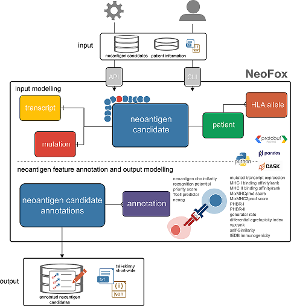

# Overview

Welcome to the documentation of NeoFox!

## About NeoFox
Neoantigens are tumour-specific antigens encoded by somatic mutations and their break down (neoepitopes) are presented by the Major Histocompatibility Complex (MHC) on the surface of tumor cells products to T-cells which recognize these neoepitope sequences. This neoantigen-specfic T-cell recognition may induce a potent anti-tumoral response why neoantigens are highly interesting targets for cancer immunotherapy. Conventionally, candidates for neoantigens are predicted by mutation calling from whole exome sequencing and translating the mutation profiles into amino acid sequences. For the final step, algorithms that predict the likelihood of a neoantigen candidate sequence to be indeed a true neoantigen are required .  
Several neoantigen features that describe the ability of a neoantigen candidate sequence to induce a T-cell response have been published in the last years. ***NeoFox*** (**NEO**antigen **F**eature toolb**OX**) is a python package that annotates a given set of neoantigen candidate sequences with these neoantigen features.  
NeoFox covers neoepitope prediction by MHC binding and ligand prediction, similarity/foreignness of a neoepitope candidate sequence, combinatorial features and machine learning approaches. A list of implemented features and their references are given in Table 1.    

**Table 1**

| Name                                                    | Reference                                                                | DOI                                                                                       |
|---------------------------------------------------------|--------------------------------------------------------------------------|-------------------------------------------------------------------------------------------|
| MHC I binding affinity/rank score (netMHCpan-v4.0)      | Jurtz et al, 2017, The Journal of Immunology                             | https://doi.org/10.4049/jimmunol.1700893                                                  |
| MHC II binding affinity/rank score (netMHCIIpan-v3.2)   | Jensen et al, 2018, Immunology                                           | https://doi.org/10.1111/imm.12889                                                         |
| MixMHCpred score v2.1                                   | Bassani-Sternberg et al., 2017, PLoS Comp Bio; Gfeller, 2018, J Immunol. | https://doi.org/10.1371/journal.pcbi.1005725 ,   https://doi.org/10.4049/jimmunol.1800914 |
| MixMHC2pred score v1.2                                  | Racle et al, 2019, Nat. Biotech. 2019                                    | https://doi.org/10.1038/s41587-019-0289-6                                                 |
| Differential Agretopicity Index (DAI)                   | Duan et al, 2014, JEM; Ghorani et al., 2018, Ann Oncol.                  | https://doi.org/10.1084/jem.20141308                                                      |
| Self-Similarity                                         | Bjerregaard et al, 2017, Front Immunol.                                  | https://doi.org/10.3389/fimmu.2017.01566                                                  |
| IEDB immunogenicity                                     | Calis et al, 2013, PLoS Comput Biol.                                     | https://doi.org/10.1371/journal.pcbi.1003266                                              |
| Neoantigen dissimilarity                                | Richman et al, 2019, Cell Systems                                        | https://doi.org/10.1016/j.cels.2019.08.009                                                |
| PHBR-I                                                  | Marty et al, 2017, Cell                                                  | https://doi.org/10.1016/j.cell.2017.09.050                                                |
| PHBR-II                                                 | Marty Pyke et al, 2018, Cell                                             | https://doi.org/10.1016/j.cell.2018.08.048                                                |
| Generator rate                                          | Rech et al, 2018, Cancer Immunology Research                             | https://doi.org/10.1158/2326-6066.CIR-17-0559                                             |
| Recognition potential                                   | Łuksza et al, 2017, Nature; Balachandran et al, 2017, Nature             | https://doi.org/10.1038/nature24473 , https://doi.org/10.1038/nature24462                 |
| Vaxrank                                                 | Rubinsteyn, 2017, Front Immunol                                          | https://doi.org/10.3389/fimmu.2017.01807                                                  |
| Priority score                                          | Bjerregaard et al, 2017, Cancer Immunol Immunother.                      | https://doi.org/10.1007/s00262-017-2001-3                                                 |
| Tcell predictor                                         | Besser et al, 2019, Journal for ImmunoTherapy of Cancer                  | https://doi.org/10.1186/s40425-019-0595-z                                                 |
| neoag                                                   | Smith et al, 2019, Cancer Immunology Research                            | https://doi.org/10.1158/2326-6066.CIR-19-0155                                             |
  
\
Besides comprehensive annotation of neoantigen candidates, another attribute of NeoFox is the creation of biological meaningful representations of neoantigens and other biological units as programmatic models.  
Here, Protocol buffers is employed to model Neofox's input and output data: neoantigens, patients, MHC alleles and neoantigen feature annotations (Figure 1). Of note, this modelling allows users to expand NeoFox by customized neoantigen features, e.g. for benchmarking studies.   
\
**Figure 1**

\
\
\
*For detailed information about the required input data, output data and usage please refer to the [User guide](/03_user_guide.rst).*  
  
The data models are described in more detail [here](/05_models.md).

## Contact information
For questions, please contact Franziska Lang ([franziska.lang@tron-mainz.de](mailto:franziska.lang@tron-mainz.de)) or Pablo Riesgo Ferreiro ([pablo.riesgoferreiro@tron-mainz.de](mailto:pablo.riesgoferreiro@tron-mainz.de)).

## How to cite
Franziska Lang, & Pablo Riesgo Ferreiro. (2020, October 15). TRON-Bioinformatics/neofox: Neofox v0.3.1 (Version v0.3.1). Zenodo. http://doi.org/10.5281/zenodo.4090421