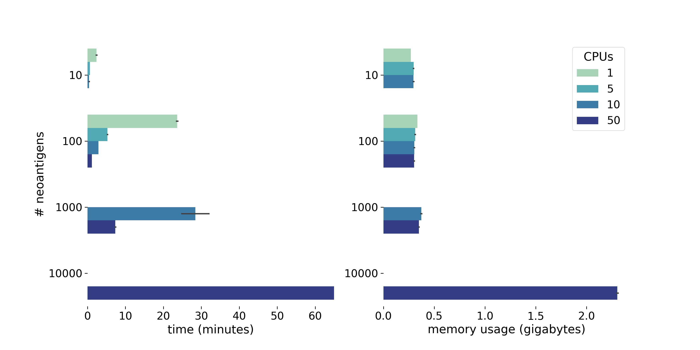

# Usage

There are two ways to use NeoFox for annotation of neoantigen candidates with neoantigen features: directly from the [command line](#command-line) or [programmatically](#api). 

## Command line

To call NeoFox from the command line, use the following command. Make sure that the requirements have been added to PATH as described [here](02_installation.md) or add a config file as described below:  

````commandline
neofox --candidate-file/--json-file neoantigens_candidates.tab/neoantigens_candidates.json --patient-data/--patient-data-json patient_data.txt/patient_data.json --output-folder /path/to/out --output-prefix out_prefix [--patient-id] [--with-short-wide-table] [--with-tall-skinny-table] [--with-json] [--num_cpus] [--affinity-threshold]
````

where:
- `--candidate-file`: tab-separated values table with neoantigen candidates represented by long mutated peptide sequences as described [here](03_01_input_data.md#tabular-file-format)
- `--json-file`: JSON file neoantigens in NeoFox model format as  described [here](03_01_input_data.md#json-file-format)
- `--patient-id`: patient identifier (*optional*, this will be used if the patient id the column `patient` is missing the candidate input file)
- `--patient-data`: a table of tab separated values containing metadata on the patient as  described [here](03_01_input_data.md#file-with-patient-information)
- `--output-folder`: path to the folder to which the output files should be written 
- `--output-prefix`: prefix for the output files (*optional*)
- `--with-short-wide-table`: output file in [short-wide](03_02_output_data.md#short-wide-format) format (*optional*)
- `--with-tall-skinny-table`: output file in [tall-skinny](03_02_output_data.md#tall-skinny-format) format (*optional*)
- `--with-json`: output file in [JSON](03_02_output_data.md#json-format) format (*optional*)
- `--num_cpus`: number of CPUs to use (*optional*)
- `--config`: a config file with the paths to dependencies as shown below  (*optional*)
- `--affinity-threshold`: a affinity value (*optional*) neoantigen candidates with a best predicted affinity greater than or equal than this threshold will be not annotated with features that specifically model
                        neoepitope recognition. A threshold that is commonly used is 500 nM. 


**PLEASE NOTE THE FOLLOWING HINTS**:   
- provide the neoantigen candidate file either as `--candidate-file` or `--json-file` 
- if no specific output format is selected, the output will be written in [short-wide](03_02_output_data.md#short-wide-format) format
- if all expression values related to a patient are NA, imputated expression will be used for the relevant features

**EXAMPLE**  
This is an example to call NeoFox with a candidate-file and obtaining the annotated neoantigen candidates in [short-wide](03_02_output_data.md#short-wide-format) format:  

````commandline
neofox --candidate-file neoantigens_candidates.tab --patient-id Ptx --patient-data patient_data.tab --output-folder /path/to/out --output-prefix test
````

The optional **config** file with the paths to the dependencies can look like this:  
````commandline
export NEOFOX_REFERENCE_FOLDER=path/to/reference/folder
export NEOFOX_RSCRIPT=`which Rscript`
export NEOFOX_BLASTP=path/to/ncbi-blast-2.10.1+/bin/blastp
export NEOFOX_NETMHCPAN=path/to/netMHCpan-4.1/netMHCpan
export NEOFOX_NETMHC2PAN=path/to/netMHCIIpan-4.0/netMHCIIpan
export NEOFOX_MIXMHCPRED=path/to/MixMHCpred-2.1/MixMHCpred
export NEOFOX_MIXMHC2PRED=path/to/MixMHC2pred-1.2/MixMHC2pred_unix
export NEOFOX_MAKEBLASTDB=path/to/ncbi-blast-2.8.1+/bin/makeblastdb
export NEOFOX_PRIME=/path/to/PRIME/PRIME
````

### Running from docker

In order to run the command line in a docker image, all of the above applies but
some additional steps are required.

If the docker image is named `neofox-docker`, run as follows: `docker run neofox-docker neofox --help`

In order to copy the NeoFox input and output data to and from the docker container, a docker volume needs to be created for 
mapping a folder in the host to a folder in the container using the `-v VOLUME_NAME:ABSOLUTE_FOLDER_IN_CONTAINER` argument.

First create a volume:
```
docker volume create neofox-volume
```

Identify the folder where the volume is mounted in the host:
```
$ docker volume inspect neofox-volume
[
    {
        "CreatedAt": "2021-03-25T21:40:23+01:00",
        "Driver": "local",
        "Labels": {},
        "Mountpoint": "/var/snap/docker/common/var-lib-docker/volumes/neofox-volume/_data",
        "Name": "neofox-volume",
        "Options": {},
        "Scope": "local"
    }
]
```

In the case above the folder is `/var/snap/docker/common/var-lib-docker/volumes/neofox-volume/_data`.
Copy the input data into that folder.

Now, NeoFox can be run as follows mounting the volume as indicated. 
Note that the output folder needs to be specified within the volume, if the output from NeoFox should be recovered.
```
docker run -v neofox-volume:/app/data neofox-docker \
neofox --candidate-file /app/data/test_model_file.txt \
--patient-data /app/data/test_patient_info.txt \
--output-folder /app/data/output
```

## API

NeoFox can be used programmatically and by that integrated into existing tools. Here, we will explain the use of NeoFox by API in short with the help of a dummy example that includes building models from scratch (For a detailed description, please refer to [this notebook](notebooks/api_usage.ipynb)). The models can be created based on files, too. In this case, ignore step 2-5 and refer to the note on the bottom of this paragraph.   

### Import requirements
Run NeoFox by passing the validated neoantigen object and the validated patient object to get the neoantigen features. The output is a list of type `NeoantigenAnnotations`:  
    
```python
annotations = NeoFox(neoantigens=[validated_neoantigen], patients=[validated_patient], num_cpus=2).get_annotations()
```
  
```python
from neofox.model.conversion import ModelConverter
from neofox.model.conversion import ModelValidator
from neofox.model.neoantigen import Neoantigen, Mutation, Patient
from neofox.neofox import NeoFox
```    

### Create a neoantigen model  

Create a neoantigen candidate model based on Transcript and Mutation model. Initialise each of these models by passing the required information:

```python
# model the mutation related to the neoantigen candidate
mutation = Mutation(mutated_xmer="AAAAAAAAAAAAARAAAAAAAAAAAAA", wild_type_xmer="AAAAAAAAAAAAAMAAAAAAAAAAAAA")
# create a neoantigen candidate model using the transcript and mutation model
neoantigen = Neoantigen(mutation=mutation, patient_identifier="Ptx", rna_expression=0.52, rna_variant_allele_frequency=0.88, dna_variant_allele_frequency=0.29)
```   
   where:  
       - `mutation`: Mutation model, created with `Mutation()` (explanation of the parameters is provided [here](05_models.md#mutation))  
       - `neoantigen`: Neoantigen candidate model, created with `Neoantigen()` (explanation of the parameters is provided [here](05_models.md#neoantigen))

### Validate the neoantigen model  
    
Check for validity of the entered parameters into the neoantigen models and the validity of the full neoantigen model:   

```python
validated_neoantigen = ModelValidator.validate_neoantigen(neoantigen=neoantigen)
``` 
   
**NOTE**: `ModelValidator.validate_neoantigen(neoantigen)` will internally validate the transcript and mutation model.

### Create a patient model  
    
Create a patient model based on models for MHC I and MHC II alleles. Initialise each of these models by passing the required information.

But, in order to parse MHC alleles and being able to normalize them into the standard nomenclature we will need to load some resources.
```python
from neofox.references.references import ReferenceFolder
reference_folder = ReferenceFolder()
```

The following shows a dummy example:

```python
# model the MHC I alleles of a patient 
mhc1 = ModelConverter.parse_mhc1_alleles(
       alleles=["HLA-A*01:01:02:03N", "HLA-A*01:02:02:03N", "HLA-B*01:01:02:03N", "HLA-B*01:01:02:04N", "HLA-C*01:01"], 
       hla_database=reference_folder.get_hla_database())
# model the MHC II alleles of a patient
mhc2 = ModelConverter.parse_mhc2_alleles(
       alleles=["HLA-DPA1*01:01", "HLA-DPA1*01:02", "HLA-DPB1*01:01", "HLA-DPB1*01:01", "HLA-DRB1*01:01", "HLA-DRB1*01:01"],
       hla_database=reference_folder.get_hla_database())
patient = Patient(identifier="Ptx", mhc1=mhc1, mhc2=mhc2)
```

where:  
       - `mhc1`: Model of MHC class I alleles, created with `ModelConverter.parse_mhc1_alleles()`. Single alleles for HLA-A, HLA-B and HLA-C should be provided with *at least 4-digits* but more digits are allowed. Homozygous alleles should be added twice. (more details about this model are provided [here](05_models.md#mhc1))  
       - `mhc2`: Model of MHC class II alleles, created with `ModelConverter.parse_mhc2_alleles()`. Single alleles for HLA-DRB1, HLA-DQA1, HLA-DQB1, HLA-DPA1 and HLA-DPB1 should be provided with *at least 4-digits* but more digits are allowed. Homozygous alleles should be added twice. (more deteails are provided [here](05_models.md#mhc2))   
       - `patient`: Patient model  created with `Patient()`(explanation of the parameters is provided [here](05_models.md#patient))
       
### Validate the patient model  

Check for validity of the patient model: 

```python
validated_patient = ModelValidator.validate_patient(patient=patient)
```  

**NOTE**: `ModelValidator.validate_patient(patient)` will internally validate MHC I and MHC II alleles.
   
### Run NeoFox  

Run NeoFox by passing the validated neoantigen object and the validated patient object to get the neoantigen features. The output is a list of type `NeoantigenAnnotations`:  

```python
annotations = NeoFox(neoantigens=[validated_neoantigen], patients=[validated_patient], num_cpus=2).get_annotations()
```  

where:  
       - `anotations`: list of type `NeoantigenAnnotations`, i.e. a list of neoantigen features and there values for given neoantigen candidates (further explanation is provided [here](05_models.md#neoantigenannotations))  
       - `neoantigens`: a list of validated neoantigen objects  
       - `patients`: a list of validated patient objects  
       - `num_cpus`: number of CPUs to use (*optional*)
       
### Transformation of the output   
    
Depending on the use case, the user can transform the resulting neoantigen feature annotations into the formats described [here](03_02_output_data.md).

```python
# short-wide 
annotations_sw = ModelConverter.annotations2short_wide_table(neoantigen_annotations=annotations, neoantigens=[validated_neoantigen])
# tall-skinny
annotations_ts = ModelConverter.annotations2tall_skinny_table(neoantigen_annotations=annotations)
# JSON 
neoantigen_json = ModelConverter.objects2json(model_objects=[validated_neoantigen])
annotations_json = ModelConverter.objects2json(model_objects=annotations)
```
   
   
**PLEASE NOTE THE FOLLOWING HINTS**:   

- process multiple neoantigens by passing a list of validated neoantigens and a list of validated patients to `NeoFox().get_annotations()` in step 6.
- only the transformation of the annotation with `ModelConverter.annotations2short_wide_table()` will keep both information of neoantigen candidates and annotated features values. with Neoantigen objects can be transformed into other formats, too when `ModelConverter.annotations2tall_skinny_table()` or `ModelConverter.objects2json()` were used. In case of our example:  

```python
# convert neoantigens into data frame
neoantigens_df = ModelConverter.objects2dataframe(model_objects=[validated_neoantigen])
# convert neoantigens into JSON format 
neoantigens_json = ModelConverter.objects2json(model_objects=[validated_neoantigen])
```   
- instead of creating neoantigen or patient models (step2-5), tabular or json files containing this information can be passed:  
  The neoantigen candidates can be provided in [candidate-file format](03_01_input_data.md#tabular-file-format)

```python
model_file = "/path/to/neoantigen_candidates.tab"
neoantigens, external_annotations = ModelConverter.parse_neoantigens_file(neoantigens_file=model_file)
```
  
 
or in [JSON format](03_01_input_data.md#json-file-format). 

```python
json_file = "/path/to/neoantigen_candidates.json"
neoantigens, external_annotations = ModelConverter.parse_neoantigens_json_file(json_file=json_file)  
```  

The patient information should be provided in [tabular format](03_01_input_data.md#file-with-patient-information)

```python
patient_file = "/path/to/patients.tab"
patients = ModelConverter.parse_patients_file(patients_data)
```  
  
Then, run NeoFox as explained in step 6 by calling:

```python
annotations = NeoFox(neoantigens=neoantigens, patients=patients, num_cpus=2).get_annotations()
```

## Performance

As indicated above NeoFox can run in parallel using the parameter `--num-cpus`. 
Each CPU will process one neoantigen candidate at a time, thus NeoFox uses only as many CPUs as candidats are to be processed.

We processed several simulated datasets with 10, 100, 1000 and 10000 neoantigen candidates on 1, 5, 10 and 50 CPUs. We obtained 
that the average time to process a single candidat in a single CPU takes 20.023 seconds, with a standard deviation of 
6,125 seconds. No significant overhead due to parallelization was observed. 
In terms of memory the application uses less than 0.5 GB for up to 1000 neoantigen candidates irrespective of the number of CPUs used. 
The memory use grows to around 2.5 GB when processing 10000 candidates. 



If either MHC I or II alleles are not provided at all for a given patient the computation will be lighter as no 
annotations run for the missing MHC.