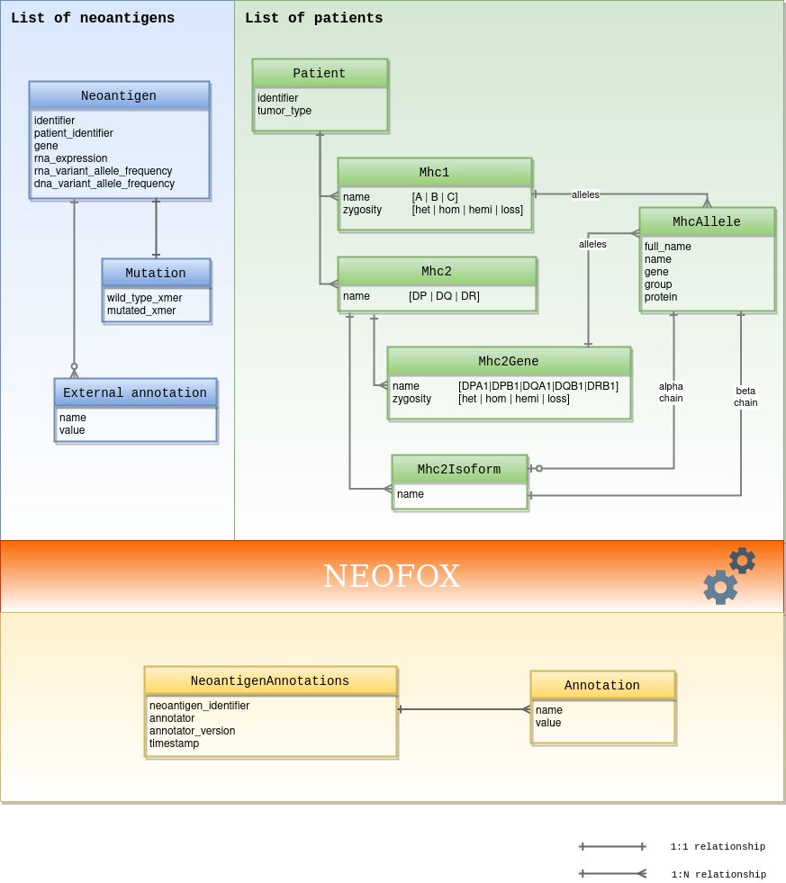

# Data models

Protocol Buffers is employed to model Neofox's input and output data: neoantigens, Major Histocompatibility Complex (MHC) alleles, patients and output annotations.

## Table of Contents

- [neoantigen.proto](#neoantigen.proto)
    - [Annotation](#neoantigen.Annotation)
    - [Mhc1](#neoantigen.Mhc1)
    - [Mhc2](#neoantigen.Mhc2)
    - [Mhc2Gene](#neoantigen.Mhc2Gene)
    - [Mhc2Isoform](#neoantigen.Mhc2Isoform)
    - [MhcAllele](#neoantigen.MhcAllele)
    - [Mutation](#neoantigen.Mutation)
    - [Neoantigen](#neoantigen.Neoantigen)
    - [NeoantigenAnnotations](#neoantigen.NeoantigenAnnotations)
    - [Patient](#neoantigen.Patient)
    - [Transcript](#neoantigen.Transcript)
  
    - [Mhc1Name](#neoantigen.Mhc1Name)
    - [Mhc2GeneName](#neoantigen.Mhc2GeneName)
    - [Mhc2Name](#neoantigen.Mhc2Name)
    - [Zygosity](#neoantigen.Zygosity)
  
- [Scalar Value Types](#scalar-value-types)

<a href="#top">Top</a>

## neoantigen.proto

### Annotation
This is a generic class to hold annotations from Neofox

| Field | Type | Label | Description |
| ----- | ---- | ----- | ----------- |
| name | [string](#string) |  | The name of the annotation |
| value | [string](#string) |  | The value of the annotation TODO: make this better to hold int, float and bool |

### Mhc1
Models MHC I alleles related to the same MHC I gene, i.e. 2 alleles/2 isoforms per gene

| Field | Type | Label | Description |
| ----- | ---- | ----- | ----------- |
| name | [Mhc1Name](#neoantigen.Mhc1Name) |  | MHC I gene name |
| zygosity | [Zygosity](#neoantigen.Zygosity) |  | Zygosity of the gene |
| alleles | [MhcAllele](#neoantigen.MhcAllele) | repeated | The alleles of the gene (0, 1 or 2) |

### Mhc2
Models MHC II alleles related to the same MHC II protein, i.e. 4 isoforms related to 2 genes with 2 alleles each

| Field | Type | Label | Description |
| ----- | ---- | ----- | ----------- |
| name | [Mhc2Name](#neoantigen.Mhc2Name) |  | MHC II molecule name |
| genes | [Mhc2Gene](#neoantigen.Mhc2Gene) | repeated | List of MHC II genes |
| isoforms | [Mhc2Isoform](#neoantigen.Mhc2Isoform) | repeated | Different combinations of MHC II alleles building different isoforms |

### Mhc2Gene
MHC II gene

| Field | Type | Label | Description |
| ----- | ---- | ----- | ----------- |
| name | [Mhc2GeneName](#neoantigen.Mhc2GeneName) |  | MHC II gene name |
| zygosity | [Zygosity](#neoantigen.Zygosity) |  | Zygosity of the gene |
| alleles | [MhcAllele](#neoantigen.MhcAllele) | repeated | The alleles of the gene (0, 1 or 2) |

### Mhc2Isoform
MHC II isoform

| Field | Type | Label | Description |
| ----- | ---- | ----- | ----------- |
| name | [string](#string) |  | Name to refer to the MHC II isoform |
| alphaChain | [MhcAllele](#neoantigen.MhcAllele) |  | The alpha chain of the isoform |
| betaChain | [MhcAllele](#neoantigen.MhcAllele) |  | The beta chain of the isoform |

### MhcAllele
MHC allele representation. It does not include non synonymous changes to the sequence, changes in the non coding region
or changes in expression. See http://hla.alleles.org/nomenclature/naming.html for details

| Field | Type | Label | Description |
| ----- | ---- | ----- | ----------- |
| fullName | [string](#string) |  | HLA full name as provided by the user (e.g.: HLA-DRB1*13:01:02:03N). This will be parsed into name, gene and group. Any digit format is allowed for this field (ie: 4, 6 or 8 digits), 2 digits names are not specific enough for our purpose and thus invalid |
| name | [string](#string) |  | A specific HLA protein (e.g. HLA-DRB1*13:01). Alleles whose numbers differ in group and protein must differ in one or more nucleotide substitutions that change the amino acid sequence of the encoded protein. This name is normalized to avoid different representations of the same allele. For instance both HLA-DRB113:01 and HLA-DRB1*13:01:02:03N will be transformed into their normalised version HLA-DRB1*13:01. This name is also truncated to 4 digits. 2 digits names are not specific enough for our purpose and thus invalid |
| gene | [string](#string) |  | The gene from either MHC I or II (e.g. DRB1, A) (this information is redundant with the Mhc1Gene.name and Mhc2Gene.name but it is convenient to have this at this level too, code will check for data coherence) |
| group | [string](#string) |  | A group of alleles defined by a common serotype ie: Serological antigen carried by an allotype (e.g. 13 from HLA-DRB1*13) |
| protein | [string](#string) |  | A specific protein (e.g.: 02 from HLA-DRB1*13:02) |

### Mutation

| Field | Type | Label | Description |
| ----- | ---- | ----- | ----------- |
| position | [int32](#int32) | repeated | The aminoacid position within the neoantigen candidate sequence. 1-based, starting in the N-terminus |
| wildTypeXmer | [string](#string) |  | Amino acid sequence of the WT corresponding to the neoantigen candidate sequence (IUPAC 1 letter codes) |
| mutatedXmer | [string](#string) |  | Amino acid sequence of the neoantigen candidate (IUPAC 1 letter codes) |

### Neoantigen
A neoantigen minimal definition

| Field | Type | Label | Description |
| ----- | ---- | ----- | ----------- |
| identifier | [string](#string) |  | A unique identifier of a neoantigen |
| patientIdentifier | [string](#string) |  | Patient identifier |
| transcript | [Transcript](#neoantigen.Transcript) |  | The transcript where the neoepitope was observed |
| mutation | [Mutation](#neoantigen.Mutation) |  | The mutation |
| clonalityEstimation | [bool](#bool) |  | Clonality estimation. At the moment this is a boolean indicating whether there is clonality or not, there is no quantitive measurement at the moment. |
| rnaExpression | [float](#float) |  | Expression value of the transcript from RNA data. Range [0, +inf]. |
| dnaVariantAlleleFrequency | [float](#float) |  | Variant allele frequency from the DNA. Range [0.0, 1.0] |
| rnaVariantAlleleFrequency | [float](#float) |  | Variant allele frequency from the RNA. Range [0.0, 1.0] |

### NeoantigenAnnotations
A set of annotations for a neoantigen

| Field | Type | Label | Description |
| ----- | ---- | ----- | ----------- |
| neoantigenIdentifier | [string](#string) |  | A unique identifier of a neoantigen |
| annotations | [Annotation](#neoantigen.Annotation) | repeated | List of annotations |
| annotator | [string](#string) |  | The annotator |
| annotatorVersion | [string](#string) |  | The version of the annotator |
| timestamp | [string](#string) |  | A timestamp determined when the annotation was created |
| resourcesHash | [string](#string) |  | Annotation resources MD5 hash |

### Patient
The metadata required for analysis for a given patient + its patient identifier

| Field | Type | Label | Description |
| ----- | ---- | ----- | ----------- |
| identifier | [string](#string) |  | Patient identifier |
| isRnaAvailable | [bool](#bool) |  | Is RNA expression available? |
| tumorType | [string](#string) |  | Tumor entity in TCGA study abbrevation style as described here: https://gdc.cancer.gov/resources-tcga-users/tcga-code-tables/tcga-study-abbreviations |
| mhc1 | [Mhc1](#neoantigen.Mhc1) | repeated | MHC I classic molecules |
| mhc2 | [Mhc2](#neoantigen.Mhc2) | repeated | MHC II classic molecules |

### Transcript

| Field | Type | Label | Description |
| ----- | ---- | ----- | ----------- |
| identifier | [string](#string) |  | The transcript identifier to which this neoantigen candidate relates to (e.g.: Ensembl transcript id) |
| assembly | [string](#string) |  | The genome assembly to which the gene definition refers to (e.g.: GRCh37, GRCh38) |
| gene | [string](#string) |  | The gene symbol or gene identifier, optional as the transcript unequivocally identifies a gene |

 <!-- end messages -->

### Mhc1Name
Valid names for MHC I classic genes

| Name | Number | Description |
| ---- | ------ | ----------- |
| A | 0 |  |
| B | 1 |  |
| C | 2 |  |

### Mhc2GeneName
Valid names for MHC II classic genes.
DRA is not included in this list as it does not have much variability in the population and for our purpose is
considered constant.

| Name | Number | Description |
| ---- | ------ | ----------- |
| DRB1 | 0 |  |
| DPA1 | 1 |  |
| DPB1 | 2 |  |
| DQA1 | 3 |  |
| DQB1 | 4 |  |

### Mhc2Name
Valid names for MHC II classic molecules

| Name | Number | Description |
| ---- | ------ | ----------- |
| DR | 0 |  |
| DP | 1 |  |
| DQ | 2 |  |

### Zygosity
The zygosity of a given gene

| Name | Number | Description |
| ---- | ------ | ----------- |
| HOMOZYGOUS | 0 | Two equal copies of the gene |
| HETEROZYGOUS | 1 | Two different copies of the gene |
| HEMIZYGOUS | 2 | Only one copy of the gene |
| LOSS | 3 | No copy of the gene |

 <!-- end enums -->

 <!-- end HasExtensions -->

 <!-- end services -->

## Scalar Value Types

| .proto Type | Notes | C++ | Java | Python | Go | C# | PHP | Ruby |
| ----------- | ----- | --- | ---- | ------ | -- | -- | --- | ---- |
| <a name="double" /> double |  | double | double | float | float64 | double | float | Float |
| <a name="float" /> float |  | float | float | float | float32 | float | float | Float |
| <a name="int32" /> int32 | Uses variable-length encoding. Inefficient for encoding negative numbers – if your field is likely to have negative values, use sint32 instead. | int32 | int | int | int32 | int | integer | Bignum or Fixnum (as required) |
| <a name="int64" /> int64 | Uses variable-length encoding. Inefficient for encoding negative numbers – if your field is likely to have negative values, use sint64 instead. | int64 | long | int/long | int64 | long | integer/string | Bignum |
| <a name="uint32" /> uint32 | Uses variable-length encoding. | uint32 | int | int/long | uint32 | uint | integer | Bignum or Fixnum (as required) |
| <a name="uint64" /> uint64 | Uses variable-length encoding. | uint64 | long | int/long | uint64 | ulong | integer/string | Bignum or Fixnum (as required) |
| <a name="sint32" /> sint32 | Uses variable-length encoding. Signed int value. These more efficiently encode negative numbers than regular int32s. | int32 | int | int | int32 | int | integer | Bignum or Fixnum (as required) |
| <a name="sint64" /> sint64 | Uses variable-length encoding. Signed int value. These more efficiently encode negative numbers than regular int64s. | int64 | long | int/long | int64 | long | integer/string | Bignum |
| <a name="fixed32" /> fixed32 | Always four bytes. More efficient than uint32 if values are often greater than 2^28. | uint32 | int | int | uint32 | uint | integer | Bignum or Fixnum (as required) |
| <a name="fixed64" /> fixed64 | Always eight bytes. More efficient than uint64 if values are often greater than 2^56. | uint64 | long | int/long | uint64 | ulong | integer/string | Bignum |
| <a name="sfixed32" /> sfixed32 | Always four bytes. | int32 | int | int | int32 | int | integer | Bignum or Fixnum (as required) |
| <a name="sfixed64" /> sfixed64 | Always eight bytes. | int64 | long | int/long | int64 | long | integer/string | Bignum |
| <a name="bool" /> bool |  | bool | boolean | boolean | bool | bool | boolean | TrueClass/FalseClass |
| <a name="string" /> string | A string must always contain UTF-8 encoded or 7-bit ASCII text. | string | String | str/unicode | string | string | string | String (UTF-8) |
| <a name="bytes" /> bytes | May contain any arbitrary sequence of bytes. | string | ByteString | str | []byte | ByteString | string | String (ASCII-8BIT) |
