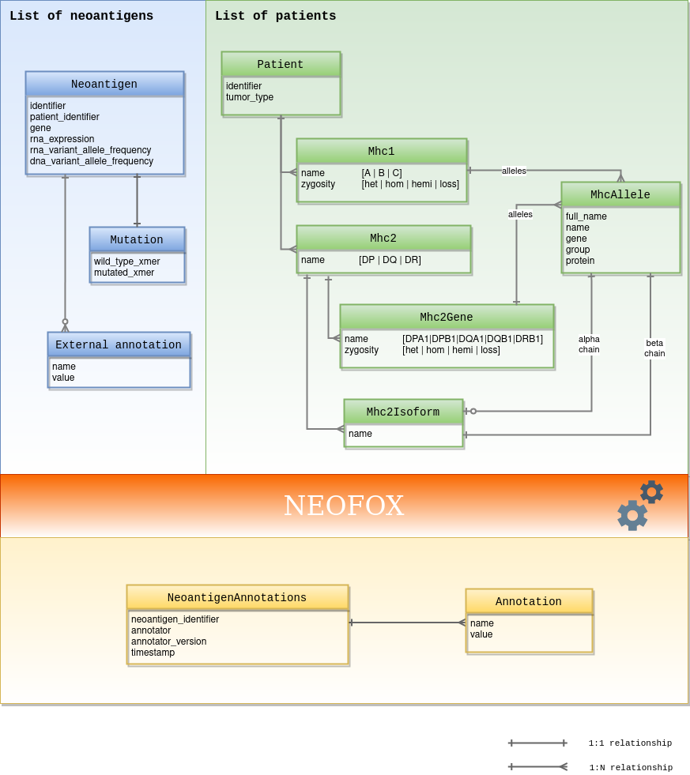

###########
Data models
###########

Protocol buffers is employed to model Neofox's input and output data: neoantigens, Major Histocompatibility Complex (MHC) alleles and annotations.

`Protocol buffers documentation <neoantigen.html>`_
